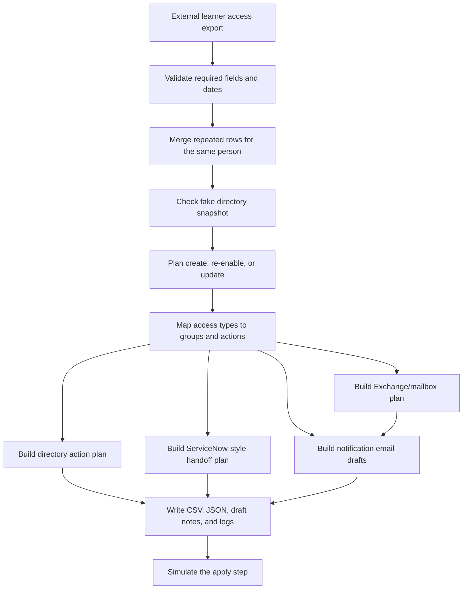

# External Access Onboarding Automation Demo

This is a sanitized PowerShell project based on a real external-access onboarding workflow I worked on.

## Project Background

The original script replaced an entire student / learner onboarding process inside an organization. Before the automation, onboarding required a lot of manual checking, account work, access review, reporting, and handoffs between systems and teams.

I worked on the script over months, testing and fine-tuning it as edge cases showed up. By the end, it automated nearly everything in that onboarding workflow: reading the source export, finding or creating the right account path, planning access, handling dates, preparing output files, and creating the information other teams needed to finish their part.

This public version is not the private production script. It is a cleaned and sanitized version that keeps the structure and thinking behind the original while replacing every workplace-specific system, name, path, group, ticket, and domain with fake examples.

## Real-World Impact

The original workflow ran live in a hospital environment and replaced a full student / learner onboarding process. It handled high-volume onboarding periods where hundreds of learner records could be processed in a day and thousands across a month.

The value was not just speed. It reduced repeated manual work for the application team by turning CSV-based intake into a repeatable workflow that could plan accounts, group membership, mailbox needs, ServiceNow-style task handoffs, notification emails, and review reports from the same source data.

In an interview, I would describe this as a PowerShell automation project that replaced a manual onboarding system, supported production healthcare onboarding volume, and saved thousands of manual work hours by coordinating account and access work across multiple systems.

## The Problem It Solved

The original problem was not just "read a CSV and make users." It had to deal with the messy parts of learner onboarding from an outside source system:

- one person showing up on multiple CSV rows because they needed multiple access types
- matching people back to existing directory accounts by an external ID, access ID, or email
- deciding whether an account should be created, re-enabled, or updated
- cleaning up dates from the source export
- creating a unique username when the source system did not provide one
- planning mailbox, app, shared drive, license, remote access, and group membership work
- splitting the final plan into directory, Exchange/mailbox, and service desk handoff outputs
- creating ServiceNow-style task summaries and notification email drafts
- writing exports and draft notes so other teams could review the work

This public version keeps that workflow, but all workplace details were replaced with fake data. It does **not** connect to Active Directory, Microsoft 365, Entra ID, ticketing tools, email, file shares, or any real system.

## Workflow



## What This Shows

- PowerShell scripting for real IT admin workflow problems
- CSV import and validation
- grouping repeated source rows into one person record
- fake directory matching by external ID, username, or email
- create / re-enable / update decision logic
- unique username and display name handling
- date parsing and normalized output
- CSV edge-case checks for shifted columns, unclear yes/no fields, bad statuses, and date problems
- access-type flags and group planning
- directory action planning
- Exchange/mailbox planning
- ServiceNow-style handoff planning
- group membership planning
- notification email draft generation
- report exports in CSV, JSON, Markdown, and log formats
- a safe simulation mode before any real changes would happen

## Original Workflow Scope

The original production version was much larger and more connected than this public demo. Based on the private script structure, it included:

- directory lookups and account updates
- account re-enable logic
- unique username and display-name handling
- temporary password generation
- learner/access object shaping
- access type consolidation
- date cleanup for rotation windows
- directory account action planning
- Exchange/mailbox action planning
- service desk / ticket handoff preparation
- application/support team notification preparation
- export generation
- notification preparation
- logging for testing and review

That is why this project is written as a workflow engine instead of a tiny one-off helper script.

## DevOps / Automation Interview Angle

This project is useful to discuss in a DevOps interview because it shows more than basic scripting syntax:

- I took a manual operational process and turned it into a repeatable automation workflow.
- I designed around messy CSV input, duplicate records, missing values, date issues, and unclear flags.
- I separated planning from action so the workflow could be reviewed before touching accounts.
- I coordinated work across identity, email, service desk, application access, group membership, and reporting.
- I added logs and exports so runs could be checked after execution.
- I sanitized the public version by replacing private integrations with fake data, local reports, and simulation output.

## Why I Think This Is Useful

This is closer to the kind of automation that actually happens in IT: a source system gives you imperfect data, different teams need different outputs, and the script has to be careful before anything touches accounts.

For a portfolio, the value is not that this demo creates fake users. The value is that it shows the structure behind a production-style onboarding workflow: validate first, merge duplicate rows, make a plan, produce reviewable output, and only then simulate the changes.

It also shows something important about real automation work: the hard part is not only writing commands. The hard part is handling messy input, weird exceptions, repeated records, existing accounts, date windows, audit needs, and handoffs without breaking the onboarding process.

## Run It

From this folder:

```powershell
powershell -ExecutionPolicy Bypass -File .\scripts\Invoke-AccountOnboardingDemo.ps1 `
  -CsvPath .\examples\external-access-export.csv `
  -MockDirectoryPath .\examples\mock-directory-users.csv `
  -OutputDirectory .\output `
  -Mode PlanOnly
```

To run the safer end-to-end demo check:

```powershell
powershell -ExecutionPolicy Bypass -File .\tests\Run-DemoCheck.ps1
```

## Modes

- `ValidateOnly` checks the source CSV and writes validation issues if it finds any.
- `PlanOnly` builds the onboarding plan and reports.
- `SimulateApply` writes a fake apply log showing what the script would have done.

## Example Input Files

The demo uses two fake CSV files:

- `examples/external-access-export.csv` acts like the outside system export.
- `examples/mock-directory-users.csv` acts like a small fake directory lookup.

The source export includes fields like:

- `ExternalPersonId`
- `AccessType`
- `AccessId`
- `RotationStartDate`
- `RotationEndDate`
- `Program`
- `Service`
- `TrainingLevel`
- `TicketId`

## Sample Output

I included fake sample output in `examples/sample-output/` so the workflow can be reviewed without running the script first.

The most useful files to open are:

- `external-access-plan.csv` for the full merged plan
- `directory-action-plan.csv` for AD-style account work
- `exchange-mailbox-plan.csv` for Exchange/mailbox work
- `service-desk-handoff-plan.csv` for ServiceNow-style handoff work
- `notification-drafts.md` for the fake downstream notes

For interview prep, also see `docs/interview-notes.md`.

## What It Creates

The script writes output files like:

- `external-access-plan.csv`
- `external-access-plan.json`
- `access-summary.csv`
- `directory-action-plan.csv`
- `exchange-mailbox-plan.csv`
- `service-desk-handoff-plan.csv`
- `notification-drafts.md`
- `validation-errors.csv` if bad input is found
- `run-log.txt`
- `simulated-apply.log` if you run `SimulateApply`

## Safety Notes

This demo only uses:

- `example.local`
- fake people
- fake groups
- fake ticket IDs
- generic OUs
- local output files

Do not add real domains, OUs, users, groups, hostnames, network shares, tickets, emails, or workplace details to this project.
