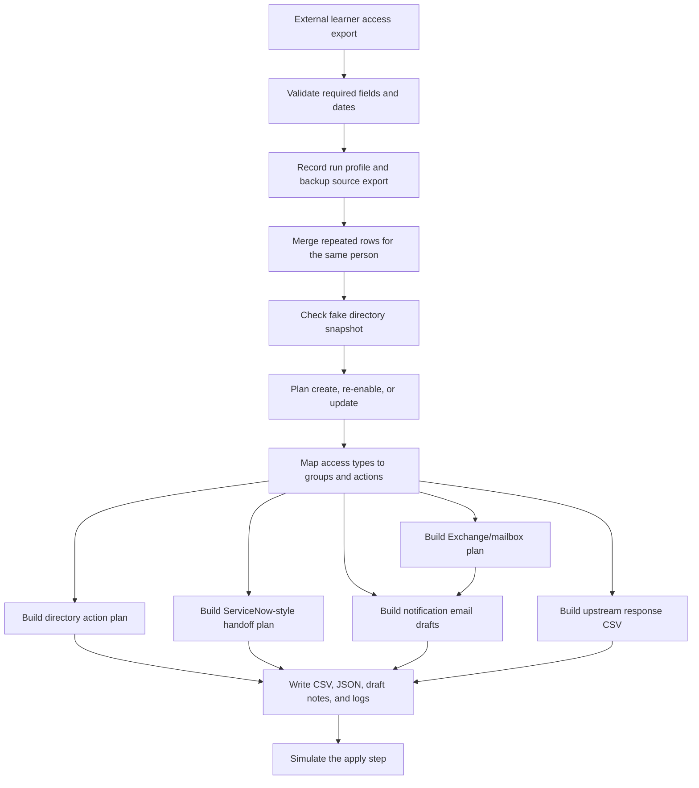

# External Access Onboarding Automation Demo

This is a sanitized PowerShell demo based on a real external-access onboarding workflow I worked on.

## What This Does

The original problem was normal IT work at scale: take an external learner export, figure out what account and access work was needed, avoid duplicate or wrong accounts, and create outputs other teams could use.

I worked on the original script over time as edge cases showed up. It handled the full flow: read the source export, merge repeated rows, match existing accounts, plan create/re-enable/update actions, handle dates, prepare mailbox and access work, and write handoff files.

This public version is not the private production script. It keeps the structure and thinking while replacing workplace-specific systems, names, paths, groups, tickets, and domains with fake examples.

The private details were removed for GitHub, but the important pieces stayed: scheduled-run context, CSV grouping, external ID matching, account lifecycle planning, access mapping, mailbox/license planning, response exports, backups, logs, and reviewable handoff files.

## The Problem It Solves

The problem was not just "read a CSV and make users." The workflow had to deal with the messy parts of onboarding from an outside source system:

- one person showing up on multiple CSV rows because they needed multiple access types
- scheduled exports landing in different run folders
- matching people back to existing directory accounts by an external ID, access ID, or email
- deciding whether an account should be created, re-enabled, or updated
- cleaning up dates from the source export
- creating a unique username when the source system did not provide one
- planning mailbox, app, shared drive, license, remote access, and group membership work
- splitting the final plan into directory, Exchange/mailbox, and service desk handoff outputs
- writing a response CSV back to the source workflow, one row per access request
- backing up the source export and recording which scheduled run profile was used
- creating ServiceNow-style task summaries and notification email drafts
- writing exports and draft notes so other teams could review the work

This demo keeps that workflow, but all workplace details are replaced with fake data. It does **not** connect to Active Directory, Microsoft 365, Entra ID, ticketing tools, email, file shares, or any real system.

## Workflow



## What It Handles

- PowerShell scripting for real IT admin workflow problems
- CSV import and validation
- scheduled run profile selection for automated exports
- local backup copy and run manifest generation
- grouping repeated source rows into one person record
- fake directory matching by external ID, username, or email
- create / re-enable / update decision logic
- unique username and display name handling
- date parsing and normalized output
- CSV edge-case checks for shifted columns, unclear yes/no fields, bad statuses, and date problems
- access-type flags and group planning
- directory action planning
- Exchange/mailbox planning
- ServiceNow-style handoff planning
- group membership planning
- notification email draft generation
- response CSV generation for the upstream workflow
- report exports in CSV, JSON, Markdown, and log formats
- a safe simulation mode before any real changes would happen

## What Was Changed For The Demo

The original version was larger and connected to real systems. This demo keeps the planning shape while turning system actions into local reports and simulation output.

The original workflow pattern included:

- directory lookups and account updates
- account re-enable logic
- unique username and display-name handling
- temporary password generation
- learner/access object shaping
- access type consolidation
- date cleanup for rotation windows
- scheduled source-file selection
- source export backup and transcript-style run logging
- directory account action planning
- Exchange/mailbox action planning
- service desk / ticket handoff preparation
- application/support team notification preparation
- export generation
- upstream response formatting
- notification preparation
- logging for testing and review

That is why this project is written more like a small workflow engine than a one-off helper script.

## What This Shows

This project shows more than basic PowerShell syntax:

- I took a manual operational process and turned it into a repeatable automation workflow.
- I designed around messy CSV input, duplicate records, missing values, date issues, and unclear flags.
- I separated planning from action so the workflow could be reviewed before touching accounts.
- I coordinated work across identity, email, service desk, application access, group membership, and reporting.
- I added logs, backups, run manifests, and response exports so runs could be checked after execution.
- Private integrations were replaced with fake data, local reports, and simulation output.

## What To Review First

If you are reviewing this as a portfolio project, start with:

1. `scripts/Invoke-AccountOnboardingDemo.ps1` for the workflow logic.
2. `examples/external-access-export.csv` for fake source data.
3. `examples/sample-output/external-access-plan.csv` for the merged plan.
4. `examples/sample-output/upstream-response-export.csv` for the fake response file sent back to the source workflow.
5. `tests/Run-DemoCheck.ps1` for the validation check.

## Why I Think This Is Worth Showing

This is closer to the kind of automation that actually happens in IT: a source system gives you imperfect data, different teams need different outputs, and the script has to be careful before anything touches accounts.

For a portfolio, the value is not that this demo creates fake users. The value is that it shows the structure behind a production-style onboarding workflow: validate first, merge duplicate rows, make a plan, produce reviewable output, and only then simulate the changes.

It also shows something important about real automation work: the hard part is not only writing commands. The hard part is handling messy input, weird exceptions, repeated records, existing accounts, date windows, audit needs, and handoffs without breaking the onboarding process.

## What This Says About My Work

This is the account/access workflow that best shows how I think through a real IT automation problem.

The hard part was not just creating accounts. The hard part was taking an imperfect outside export and turning it into something safe enough for identity, mailbox, access, and service desk work. That meant grouping repeated rows, checking for existing accounts, separating create/re-enable/update paths, keeping dates clean, and writing outputs other teams could review.

I built it around the idea that automation should make the process easier without hiding the risk. The script plans work, writes handoff files, creates logs, and leaves review points instead of pretending every row can be trusted.

## Run It

From this folder:

```powershell
powershell -ExecutionPolicy Bypass -File .\scripts\Invoke-AccountOnboardingDemo.ps1 `
  -CsvPath .\examples\external-access-export.csv `
  -MockDirectoryPath .\examples\mock-directory-users.csv `
  -OutputDirectory .\output `
  -RunProfile RunA `
  -Mode PlanOnly
```

To run the safer end-to-end demo check:

```powershell
powershell -ExecutionPolicy Bypass -File .\tests\Run-DemoCheck.ps1
```

## Modes

- `ValidateOnly` checks the source CSV and writes validation issues if it finds any.
- `PlanOnly` builds the onboarding plan and reports.
- `SimulateApply` writes a fake apply log showing what the script would have done.

## Example Input Files

The demo uses two fake CSV files:

- `examples/external-access-export.csv` acts like the outside system export.
- `examples/mock-directory-users.csv` acts like a small fake directory lookup.

The source export includes fields like:

- `ExternalPersonId`
- `AccessType`
- `AccessId`
- `RotationStartDate`
- `RotationEndDate`
- `Program`
- `Service`
- `TrainingLevel`
- `TicketId`

## Sample Output

I included fake sample output in `examples/sample-output/` so the workflow can be reviewed without running the script first.

The most useful files to open are:

- `external-access-plan.csv` for the full merged plan
- `directory-action-plan.csv` for AD-style account work
- `exchange-mailbox-plan.csv` for Exchange/mailbox work
- `service-desk-handoff-plan.csv` for ServiceNow-style handoff work
- `upstream-response-export.csv` for the fake response rows back to the source workflow
- `run-profile-manifest.json` for the fake scheduled-run context
- `notification-drafts.md` for the fake downstream notes

## What It Creates

The script writes output files like:

- `external-access-plan.csv`
- `external-access-plan.json`
- `access-summary.csv`
- `directory-action-plan.csv`
- `exchange-mailbox-plan.csv`
- `service-desk-handoff-plan.csv`
- `upstream-response-export.csv`
- `notification-drafts.md`
- `run-profile-manifest.json`
- `validation-errors.csv` if bad input is found
- `run-log.txt`
- `simulated-apply.log` if you run `SimulateApply`

## Safety Notes

This demo only uses:

- `example.local`
- fake people
- fake groups
- fake ticket IDs
- generic OUs
- local output files

Do not add real domains, OUs, users, groups, hostnames, network shares, tickets, emails, or workplace details to this project.
