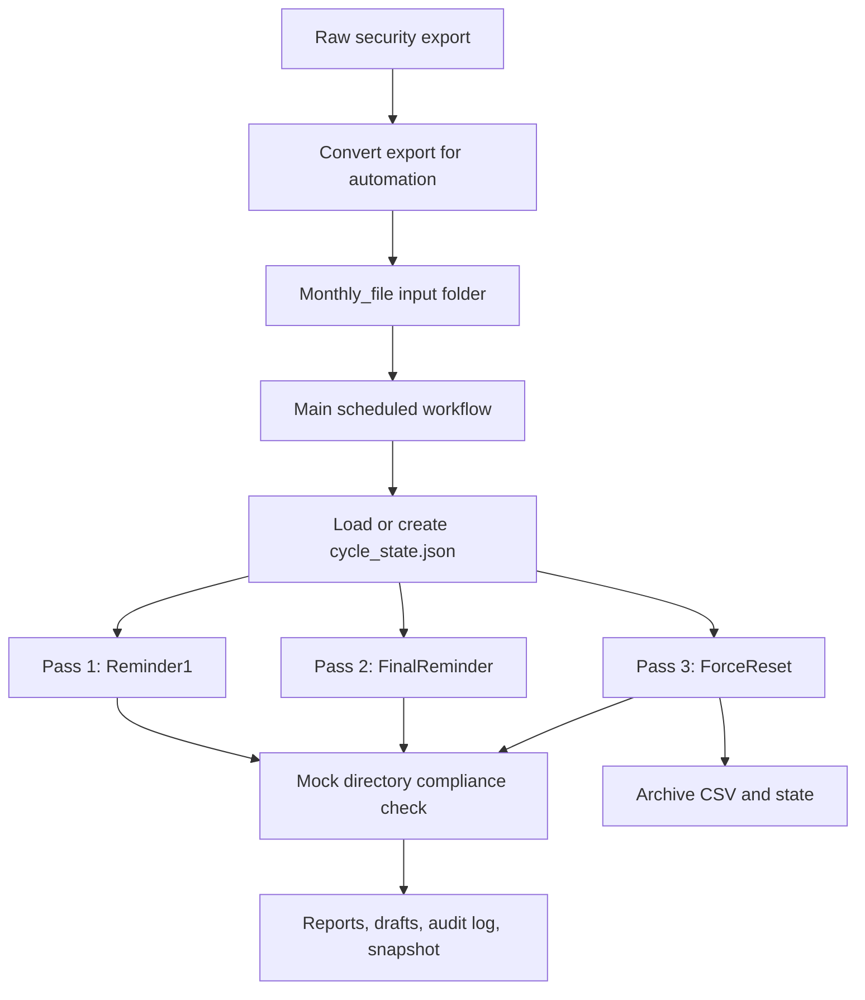

# Password Remediation Workflow Demo

This is a sanitized PowerShell demo based on a weak-password remediation system I built for IT operations.

The original was not just a CSV mailer. It was a stateful workflow that took a recurring security export, tracked an active remediation cycle, checked account status on each pass, sent staged reminders, planned final password-change enforcement, wrote audit output, and archived the evidence when the cycle was done.

This public version does not connect to Active Directory, SMTP, file shares, scheduled tasks, or any real system. It uses fake CSV files, mock directory data, local state, local reports, and simulation logs.

## What This Does

- converts a raw weak-password export into the automation input format
- enforces a one-active-CSV rule for the input folder
- validates source rows before planning anything
- calculates a SHA256 hash so the same CSV can continue an active cycle
- creates and updates a local `cycle_state.json`
- locks the compliance cutoff at the start of the cycle
- runs a three-pass workflow: first reminder, final reminder, final reset plan
- checks mock directory data on every pass instead of trusting stale CSV data
- stops processing users who become compliant after the cutoff
- skips disabled, service/special, exempt, and missing directory users
- blocks state advancement if a required notification/action would fail
- writes plan, summary, notification draft, snapshot, audit, and simulation output
- archives the CSV and state file after the final simulated pass

## The Problem This Solves

Password remediation is risky if it is handled as a simple script that emails every row every time. That can create repeated messages, miss users who already fixed the issue, advance a cycle after a failed run, or trigger final action too early.

The useful part of this system is the guardrails:

- one active input file
- stable compliance cutoff
- stateful pass tracking
- duplicate-run protection
- live directory-style checks each run
- test/simulation modes
- audit logs and snapshots
- archive evidence after completion

## Workflow



## Run It

From the project folder, run the main demo against the already-converted fake CSV:

```powershell
powershell -ExecutionPolicy Bypass -File .\scripts\Invoke-PasswordRemediationDemo.ps1 `
  -CsvPath .\examples\password-review-export.csv `
  -MockDirectoryPath .\examples\mock-directory-users.csv `
  -OutputDirectory .\output `
  -Mode PlanOnly
```

To run the converter against a fake raw security export:

```powershell
powershell -ExecutionPolicy Bypass -File .\scripts\Convert-WeakPasswordExportDemo.ps1 `
  -SourceCsv .\examples\raw-security-export.csv `
  -InputFolder .\output\Monthly_file `
  -EmailDomain example.local
```

To run the end-to-end demo check:

```powershell
powershell -ExecutionPolicy Bypass -File .\tests\Run-DemoCheck.ps1
```

The demo check proves:

- the converter creates the automation CSV
- a second active CSV is blocked
- pass 1 advances state
- an immediate duplicate run is blocked unless `-ForceRun` is used
- pass 2 advances state
- pass 3 writes final reset planning output
- final pass archives the CSV/state and removes active state

## Main Script Modes

- `ValidateOnly` checks the source export and writes validation issues if needed.
- `PlanOnly` builds reports without advancing state.
- `SimulateApply` simulates the pass, advances state, and archives after the final pass.

Useful switches:

- `-ForceRun` bypasses the duplicate-run guard for controlled testing.
- `-SimulateFinalPass` previews final-pass behavior safely.
- `-MinimumDaysBetweenLivePasses` controls the duplicate-run safety window.

## Example Inputs

- `examples/raw-security-export.csv` acts like a raw security-platform export.
- `examples/password-review-export.csv` acts like the converted automation input.
- `examples/mock-directory-users.csv` acts like a live directory lookup.

The converted source includes fields like:

- `DiscoveryDate`
- `EmployeeId`
- `SamAccountName`
- `UserPrincipalName`
- `PasswordLastSet`
- `AccountEnabled`
- `AccountType`
- `Department`
- `ManagerEmail`
- `ExemptionReason`

## What It Creates

- `password-remediation-plan.csv`
- `password-remediation-plan.json`
- `remediation-summary.csv`
- `notification-drafts.md`
- `filtered-snapshot-*.csv`
- `audit-log.txt`
- `simulated-apply.log`
- `state/cycle_state.json` while a cycle is active
- `archive/YYYY-MM/` after the final simulated pass

## Safety Notes

This demo uses only:

- `example.local`
- fake users
- fake departments
- fake manager emails
- fake account categories
- local state folders
- local output and archive folders

Do not add real domains, users, employee IDs, departments, managers, groups, emails, tickets, hostnames, file shares, production exports, screenshots, credential files, or workplace details to this project.
